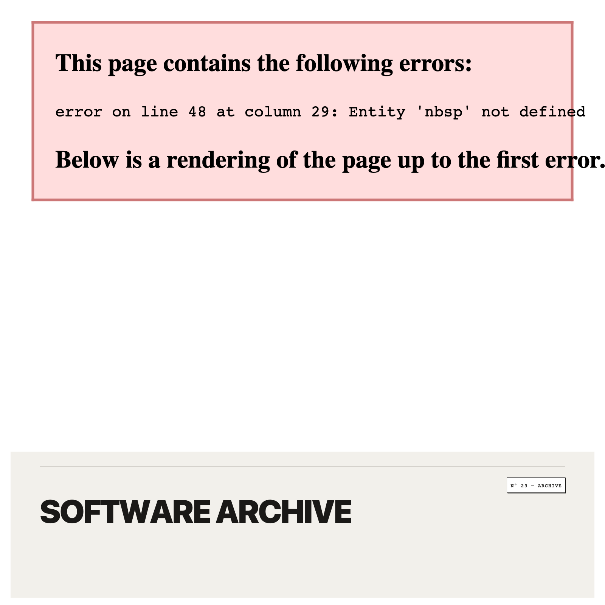

<div align="center">
  
</div>

```
KIRILL TSYGANOV // SOFTWARE ARCHIVE
COLLECTION 2026 · SPECIFICATION · DECONSTRUCTED INDUSTRIAL MINIMALISM
```

Systems & AI Automation engineer building low-latency in-memory databases, autonomous tool-calling agent sandboxes, enterprise RAG pipelines, and creative workflow runtimes. Zero framework bloat. Strict token economics. Mathematical correctness and empirical benchmarks.

```
[ SPECIFICATION TAGS ]
[ STATUS — ACTIVE ARCHIVE ]   [ RUNTIME — NODE V22 / PYTHON 3.11+ / EXTENDSCRIPT ]   [ ARCH — MEASURED METRICS ]
```

---

### [ COLLECTION A // AI AUTOMATION, CREATIVE TOOLKITS & PRODUCTION AGENTS ]

```
N° 01 — RAG-SUPPORT-BOT // RETRIEVAL-AUGMENTED GENERATION ASSISTANT
       SPEC       Semantic MarkdownNodeParser, top-3 ChromaDB retrieval, deterministic file citations, SQLite sliding window memory
       METRICS    $0.000165 / query telemetry · 791 prompt / 77 completion tokens · 0 hallucinations on out-of-domain fallback
       STATUS     [ TESTS — 5/5 VERIFIED ] · [ LICENSE — MIT ] · [ LLAMAINDEX + CHROMADB ]
       SOURCE     [ https://github.com/millymilly29/rag-support-bot ]

N° 02 — N8N-AI-LEADGEN-OUTREACH // AUTONOMOUS OUTREACH PIPELINE
       SPEC       13-node autonomous web scraper, regex heuristic gap classifier, loop-safe dual-branch error recovery, GPT-4o-mini pitch synthesis
       METRICS    2s politeness delay · $0.000057 / lead ($0.057 per 1,000) · instant Telegram preview + Google Sheets sync
       STATUS     [ WORKFLOW — 13 NODES VALIDATED ] · [ LICENSE — MIT ] · [ N8N + DOCKER ]
       SOURCE     [ https://github.com/millymilly29/n8n-ai-leadgen-outreach ]

N° 03 — N8N-AI-EXECUTIVE-ASSISTANT // TOOL-CALLING AUTONOMOUS AGENT
       SPEC       Multi-tool LangChain engine (Google Calendar, Notion, Tavily), 2-step confirm-before-write transaction gate, prompt disambiguation
       METRICS    10-turn window buffer memory · zero unconfirmed calendar writes · read/append-only OAuth scopes
       STATUS     [ TRACES — VERIFIED ] · [ LICENSE — MIT ] · [ N8N + LANGCHAIN ]
       SOURCE     [ https://github.com/millymilly29/n8n-ai-executive-assistant ]

N° 04 — MILLY-FX-PRO // AFTER EFFECTS EDITMAXXING TOOLKIT
       SPEC       Dual-architecture CEP extension + ScriptUI panel, FLIR thermal heatmap suite, bass-reactive camera shakes, CRT scanlines
       METRICS    26+ procedural FX modules · 7 one-click master aesthetic recipes · [MILLY] namespace non-destructive cleanup
       STATUS     [ SUITE — 26+ PRESETS ] · [ LICENSE — MIT ] · [ CEP 11+ / EXTENDSCRIPT ]
       SOURCE     [ https://github.com/millymilly29/millyfx-pro ]

N° 05 — AUTOMATION-CASE-STUDIES // E-COMMERCE BUSINESS AUTOMATION
       SPEC       Multi-platform content scheduler (5 channels, APScheduler), operational audit bots (aiogram), automated UTM attribution reporting
       METRICS    ~77% time reduction (~27 hrs/mo saved) · 100% on-schedule dispatch · transparent mathematical baselines
       STATUS     [ CASE STUDIES — 3/3 VERIFIED ] · [ LICENSE — MIT ] · [ PRODUCTION DATA ]
       SOURCE     [ https://github.com/millymilly29/automation-case-studies ]
```

---

### [ COLLECTION B // LOW-LATENCY SYSTEMS & RUNTIMES ]

```
N° 06 — AGENT-FIREWALL // COMMAND EXECUTION SAFETY GATEWAY
       SPEC       Deterministic AST command scanner, dry-run safety gateway, SHA-256 audit logger
       METRICS    10 threat rules (root deletion, IMDS, exfiltration) · SHA-256 forward chain
       STATUS     [ TESTS — 9/9 VERIFIED ] · [ LICENSE — MIT ] · [ DEPENDENCIES — 0 ]
       ACCESS     [ https://millymilly29.github.io/agent-firewall.html ]
       SOURCE     [ https://github.com/millymilly29/agent-firewall ]

N° 07 — SYNAPSE // IN-MEMORY HNSW VECTOR DATABASE
       SPEC       Multi-layer skip-graph index, SQ8 scalar quantization, BM25 / RRF hybrid search
       METRICS    97.0%–99.1% Recall@10 (exact ground truth) · 0.245ms P50 · -75% RAM footprint
       STATUS     [ TESTS — 17/17 VERIFIED ] · [ LICENSE — MIT ] · [ DEPENDENCIES — 0 ]
       ACCESS     [ https://millymilly29.github.io/synapse.html ]
       SOURCE     [ https://github.com/millymilly29/synapse ]

N° 08 — SUBSECOND // PREDICTIVE VOICE STREAMING ENGINE
       SPEC       RMS energy VAD, speculative intent prefetching, zero-buffer barge-in interruption
       METRICS    ~~1,650ms~~ 235ms E2E latency · <0.05ms cutoff · 15ms anti-pop de-click ramp
       STATUS     [ TESTS — 15/15 VERIFIED ] · [ LICENSE — MIT ] · [ WEB AUDIO API ]
       ACCESS     [ https://millymilly29.github.io/subsecond.html ]
       SOURCE     [ https://github.com/millymilly29/subsecond ]

N° 09 — COLUMNARJS // IN-PROCESS COLUMNAR ANALYTICS ENGINE
       SPEC       Continuous TypedArray storage (Float64Array), dictionary pool, vectorized GROUP BY
       METRICS    ~~480ms~~ 61ms for 500,000 rows (7.8x speedup) · zero GC allocation churn
       STATUS     [ TESTS — 28/28 VERIFIED ] · [ LICENSE — MIT ] · [ DEPENDENCIES — 0 ]
       ACCESS     [ https://millymilly29.github.io/columnarjs.html ]
       SOURCE     [ https://github.com/millymilly29/columnarjs ]

N° 10 — HYPERCONTEXT // 2,000,000-TOKEN CONTEXT ENGINE
       SPEC       Persistent context caching, dependency call-graph & AST blast-radius analyzer
       METRICS    -75% token cost via Gemini caching · 1.15s TTFT on 2M tokens
       STATUS     [ TESTS — 16/16 VERIFIED ] · [ LICENSE — MIT ] · [ GEMINI 2.0 API ]
       ACCESS     [ https://millymilly29.github.io/hypercontext.html ]
       SOURCE     [ https://github.com/millymilly29/hypercontext ]

N° 11 — SWARM-OPERATOR // MULTI-AGENT COORDINATION BUS
       SPEC       Event-driven multi-agent mission control, DAG execution, real-time token telemetry
       METRICS    <1ms in-memory coordination bus · 4-agent DAG topology (Plan/Code/Review/Test)
       STATUS     [ TESTS — 18/18 VERIFIED ] · [ LICENSE — MIT ] · [ VANILLA JS ]
       ACCESS     [ https://millymilly29.github.io/swarm-operator.html ]
       SOURCE     [ https://github.com/millymilly29/swarm-operator ]
```

---

### [ SPECIFICATION MATRIX ]

| NO. | OBJECT | RUNTIME / STACK | PRIMARY METRIC | STATUS | DOMAIN |
| :--- | :--- | :--- | :--- | :--- | :--- |
| `N° 01` | **RAG-SUPPORT-BOT** | Python / LlamaIndex / Chroma | `$0.000165 / query · 15 docs` | `5/5 PASS` | `AI / RAG` |
| `N° 02` | **N8N-LEADGEN** | n8n / Docker / GPT-4o-mini | `$0.057 / 1K leads · 2s rate` | `13 NODES` | `Automation` |
| `N° 03` | **N8N-ASSISTANT** | n8n / LangChain / GPT-4o | `Confirm-Before-Write Gate` | `VERIFIED` | `AI Agents` |
| `N° 04` | **MILLY-FX-PRO** | CEP 11+ / ExtendScript / AE | `26+ FX · 7 Master Presets` | `26+ PASS` | `Creative VFX` |
| `N° 05` | **CASE-STUDIES** | Python / APScheduler / Sheets | `~77% Time Saved (~27h/mo)` | `3/3 PASS` | `Case Studies` |
| `N° 06` | **AGENT-FIREWALL** | Node / Edge | `SHA-256 Audit Chain` | `9/9 PASS` | `Security` |
| `N° 07` | **SYNAPSE** | Node / Browser | `0.245ms P50 / 99.1% Rec` | `17/17 PASS` | `Databases` |
| `N° 08` | **SUBSECOND** | Web Audio / Node | `235ms E2E / <0.05ms Cut` | `15/15 PASS` | `Streaming` |
| `N° 09` | **COLUMNARJS** | V8 Memory | `500K in 61ms (7.8x)` | `28/28 PASS` | `Analytics` |
| `N° 10` | **HYPERCONTEXT** | Node / Cloud | `2M Tokens / -75% Cost` | `16/16 PASS` | `LLM Systems` |
| `N° 11` | **SWARM-OPERATOR** | Node / Browser | `<1ms Bus / 4 Nodes` | `18/18 PASS` | `Multi-Agent` |

---

### [ CORE STACK ]

```
AI & ORCHESTRATION    n8n, LlamaIndex, LangChain, OpenAI API (GPT-4o, GPT-4o-mini), ChromaDB
CREATIVE RUNTIMES     Adobe After Effects CEP 11+, ExtendScript (JSX), ScriptUI, Wiggle Dynamics
WORKFLOWS & BOTS      aiogram 3.x, Telethon, APScheduler, Google Calendar / Sheets API, Notion API
SYSTEMS & STORAGE     In-Memory Databases, TypedArrays (Float64Array, Int32Array), SQLite, Columnar Layouts
ALGORITHMS & MATH     HNSW Graph Traversal, Okapi BM25, Reciprocal Rank Fusion, Semantic Chunking
STREAMING & RUNTIMES  Web Audio API, RMS Energy VAD, Speculative Intent Prefetching, Node.js v22+, Python 3.11+
SECURITY & INTEGRITY  Deterministic AST Command Scanner, SHA-256 Hash Chaining, Dry-Run Sandboxing
```

---

```
GARMENT CARE / CONTACT
LOCATION      https://millymilly29.github.io
TELEGRAM      @therealfullmetal
EMAIL         millyrock2900@gmail.com
CARE          DO NOT BLEACH · DRY FLAT · 100% RAW CODE
```
