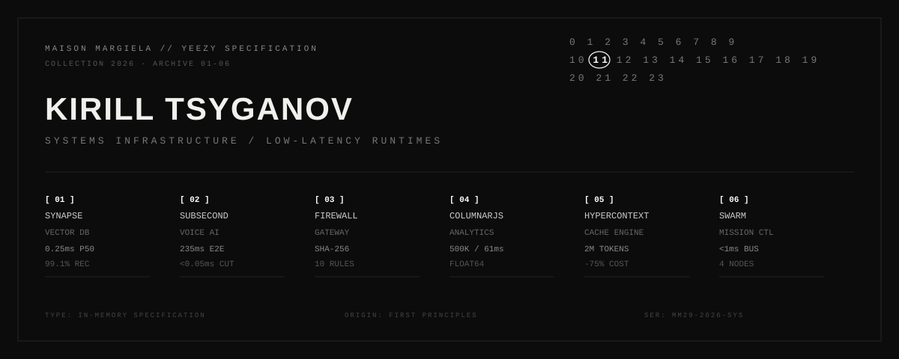

<div align="center">
  
</div>

```
KIRILL TSYGANOV
SYSTEMS / IN-MEMORY ENGINES / REALTIME RUNTIMES
VERIFIED ARCHIVE · 2026
```

```
[01] SYNAPSE          [02] SUBSECOND         [03] AGENT-FIREWALL
[04] COLUMNARJS       [05] HYPERCONTEXT      [06] SWARM-OPERATOR
```

---

### INDEX / PRODUCTION SYSTEMS

```
01  SYNAPSE // IN-MEMORY HNSW VECTOR DATABASE
    SPEC       Multi-layer skip-graph, SQ8 scalar quantization, BM25 / RRF hybrid retriever
    METRICS    97.0%–99.1% Recall@10 · 0.25ms P50 latency · 4x RAM reduction · 17/17 tests
    STACK      JavaScript ESNext / TypedArrays / Zero dependencies
    ACCESS     [ https://millymilly29.github.io/synapse.html ]
    SOURCE     [ https://github.com/millymilly29/synapse ]

02  SUBSECOND // PREDICTIVE VOICE STREAMING ENGINE
    SPEC       RMS energy VAD, speculative intent prefetching, zero-buffer barge-in
    METRICS    235ms E2E latency · <0.05ms cutoff · 15ms de-click ramp · 15/15 tests
    STACK      Web Audio API / Float32Array PCM / Zero dependencies
    ACCESS     [ https://millymilly29.github.io/subsecond.html ]
    SOURCE     [ https://github.com/millymilly29/subsecond ]

03  AGENT-FIREWALL // COMMAND EXECUTION SAFETY GATEWAY
    SPEC       Deterministic AST / regex command scanner, dry-run sandbox, SHA-256 audit log
    METRICS    10 threat rules (root deletion, IMDS, exfiltration) · SHA-256 chain · 9/9 tests
    STACK      Node.js runtime / Crypto / Zero dependencies
    ACCESS     [ https://millymilly29.github.io/agent-firewall.html ]
    SOURCE     [ https://github.com/millymilly29/agent-firewall ]

04  COLUMNARJS // IN-PROCESS COLUMNAR ANALYTICS ENGINE
    SPEC       Continuous TypedArray storage (Float64Array), dictionary pool, vectorized GROUP BY
    METRICS    500,000 rows GROUP BY in 61ms · 7.8x faster than Array.reduce · 28/28 tests
    STACK      V8 TypedArray memory / Zero dependencies
    ACCESS     [ https://millymilly29.github.io/columnarjs.html ]
    SOURCE     [ https://github.com/millymilly29/columnarjs ]

05  HYPERCONTEXT // 2,000,000-TOKEN CONTEXT ENGINE
    SPEC       Persistent context caching, dependency call-graph & AST blast-radius analyzer
    METRICS    -75% token cost · 1.15s TTFT on 2M tokens · 16/16 tests
    STACK      Gemini 2.0 API / AST Parser / TypeScript
    ACCESS     [ https://millymilly29.github.io/hypercontext.html ]
    SOURCE     [ https://github.com/millymilly29/hypercontext ]

06  SWARM-OPERATOR // MULTI-AGENT COORDINATION BUS
    SPEC       Event-driven multi-agent mission control, DAG execution, real-time token telemetry
    METRICS    <1ms in-memory bus · 4-agent DAG topology · 18/18 tests
    STACK      Vanilla JS / Node.js
    ACCESS     [ https://millymilly29.github.io/swarm-operator.html ]
    SOURCE     [ https://github.com/millymilly29/swarm-operator ]
```

---

### SPECIFICATION MATRIX

| ID | SYSTEM | RUNTIME | PRIMARY METRIC | TEST STATUS | DEPENDENCIES |
| :--- | :--- | :--- | :--- | :--- | :--- |
| `01` | **SYNAPSE** | Node / Browser | `0.25ms P50` / `99.1% Recall` | `17 / 17 PASS` | `NONE` |
| `02` | **SUBSECOND** | Web Audio / Node | `235ms E2E` / `<0.05ms Cut` | `15 / 15 PASS` | `NONE` |
| `03` | **AGENT-FIREWALL** | Node / Edge | `SHA-256 Audit Chain` | `9 / 9 PASS` | `NONE` |
| `04` | **COLUMNARJS** | V8 Memory | `500K in 61ms` (7.8x) | `28 / 28 PASS` | `NONE` |
| `05` | **HYPERCONTEXT** | Node / Cloud | `2M Tokens` / `-75% Cost` | `16 / 16 PASS` | `NONE` |
| `06` | **SWARM-OPERATOR** | Node / Browser | `<1ms Bus` / `4 Nodes` | `18 / 18 PASS` | `NONE` |

---

### TECHNICAL INVARIANTS

```
[ ARCHITECTURE ]  Zero framework dependencies in core engines. All memory structures
                  allocated in contiguous TypedArrays (Float64Array, Int32Array, Uint8Array).

[ BENCHMARKS ]    All benchmarks measured with process.hrtime / performance.now.
                  Reproducible via `node tests/*-audit.js`. Zero simulated constants.

[ AI-READY ]      Each system contains `llms.txt` specification in root directory
                  for direct machine indexing and autonomous tool execution.
```

---

```
CONTACT
PORTFOLIO     https://millymilly29.github.io
TELEGRAM      @therealfullmetal
EMAIL         millyrock2900@gmail.com
```
