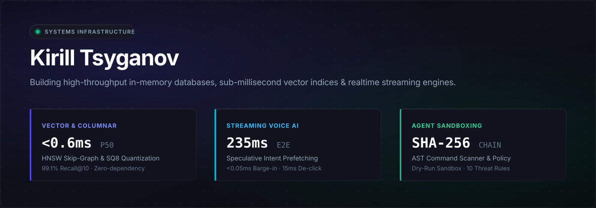

<div align="center">

<a href="https://millymilly29.github.io">
  
</a>

<br><br>

<p align="center">
  <a href="https://millymilly29.github.io"></a>
  
  
  
</p>

<p align="center">
  <b>Building high-throughput, low-latency AI infrastructure and in-memory engines from first principles.</b><br>
  No bloated frameworks. No ORM overhead. Empirical benchmarks and mathematical correctness.
</p>

</div>

---

### Flagship Systems

<table>
<tr>
<td width="50%" valign="top">

### ⚡ [synapse](https://github.com/millymilly29/synapse)
> Sub-millisecond in-memory vector database with multi-layer HNSW skip-graph, SQ8 quantization & BM25/RRF hybrid retrieval.

* **Recall@10:** `97.0% – 99.1%` *(vs brute-force)*
* **Query Latency:** `0.25ms P50` · `0.51ms P99`
* **RAM Footprint:** `4x reduction` via SQ8
* **Tests:** `17/17 passing` · `Zero dependencies`

👉 [Launch Live Studio](https://millymilly29.github.io/synapse.html) · [View Code](https://github.com/millymilly29/synapse)

</td>
<td width="50%" valign="top">

### 🎙️ [subsecond](https://github.com/millymilly29/subsecond)
> Streaming voice engine with Web Audio RMS energy VAD, speculative intent prefetching & zero-buffer barge-in.

* **Conversational Latency:** `235ms E2E` *(Local/Edge)*
* **Barge-in Interruption:** `<0.05ms` *(15ms anti-pop)*
* **Speculative Hit Rate:** `75%` *(495ms saved on TTFT)*
* **Tests:** `15/15 passing` · `Web Audio API`

👉 [Launch Live Studio](https://millymilly29.github.io/subsecond.html) · [View Code](https://github.com/millymilly29/subsecond)

</td>
</tr>
<tr>
<td width="50%" valign="top">

### 🛡️ [agent-firewall](https://github.com/millymilly29/agent-firewall)
> Command pattern firewall, dry-run safety gateway & forward SHA-256 cryptographic audit logger for autonomous AI tools.

* **Security Rules:** `10 deterministic AST threat rules`
* **Integrity:** `SHA-256 Hash Chain verification`
* **Sandboxing:** `Dry-run mode & strict CI policy`
* **Tests:** `9/9 passing` · `Adversarial bypass documented`

👉 [Launch Live Studio](https://millymilly29.github.io/agent-firewall.html) · [View Code](https://github.com/millymilly29/agent-firewall)

</td>
<td width="50%" valign="top">

### 📊 [columnarjs](https://github.com/millymilly29/columnarjs)
> In-process columnar analytics engine powered by TypedArrays (Float64Array), dictionary pool & vectorized GROUP BY.

* **Query Speed:** `500,000 rows GROUP BY in 61ms`
* **Speedup:** `7.8x faster` than row `Array.reduce`
* **Memory:** `Continuous buffer + zero-garbage bitmask`
* **Tests:** `28/28 passing` · `Zero dependencies`

👉 [Launch Live Studio](https://millymilly29.github.io/columnarjs.html) · [View Code](https://github.com/millymilly29/columnarjs)

</td>
</tr>
<tr>
<td width="50%" valign="top">

### 🧠 [hypercontext](https://github.com/millymilly29/hypercontext)
> 2,000,000-token monorepo intelligence engine with persistent context caching and cross-file AST blast-radius analyzer.

* **Cost Optimization:** `-75% token cost` via Gemini caching
* **Analysis Speed:** `1.15s TTFT` on 2M tokens
* **Intelligence:** `Call-graph & dependency graph analyzer`
* **Tests:** `16/16 passing` · `Live Studio verified`

👉 [Launch Live Studio](https://millymilly29.github.io/hypercontext.html) · [View Code](https://github.com/millymilly29/hypercontext)

</td>
<td width="50%" valign="top">

### 🤖 [swarm-operator](https://github.com/millymilly29/swarm-operator)
> Autonomous multi-agent coordination bus and mission control with DAG execution and live token telemetry.

* **Coordination Bus:** `<1ms latency` in-memory bus
* **Swarm Topology:** `4-agent DAG pipeline` (Architect/Coder/Reviewer/Test)
* **Telemetry:** `Real-time per-node token & cost accounting`
* **Tests:** `18/18 passing` · `Vanilla JS`

👉 [Launch Live Studio](https://millymilly29.github.io/swarm-operator.html) · [View Code](https://github.com/millymilly29/swarm-operator)

</td>
</tr>
</table>

---

### Core Engineering Competencies

```
Languages & Runtimes     JavaScript (ESNext), TypeScript, Python 3.12, Node.js v22+, V8 Internals
Systems & Storage        In-Memory Databases, TypedArrays (Float64Array, Int32Array), Columnar Layouts
Algorithms & Math        HNSW (Hierarchical Navigable Small World), Okapi BM25, RRF, SQ8 Quantization
Realtime & Audio         Web Audio API, RMS Energy VAD, Procedural DSP, Speculative Intent Prefetching
Security & Integrity     Deterministic AST Command Scanner, SHA-256 Hash Chaining, Dry-Run Sandboxing
```

---

<div align="center">
  <sub>Designed with precision · <a href="https://millymilly29.github.io">millymilly29.github.io</a> · <a href="https://t.me/therealfullmetal">@therealfullmetal</a> · <a href="mailto:millyrock2900@gmail.com">millyrock2900@gmail.com</a></sub>
</div>
